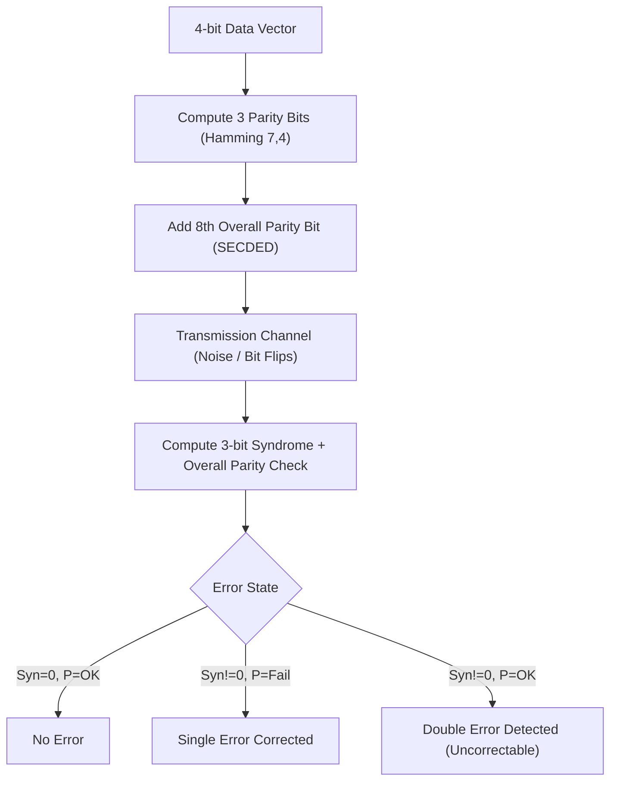

# genpark-hamming-secded-error-correction-code-skill

Agent Skill implementing **Hamming (7, 4) linear block coding and Extended SECDED (8, 4)** for single error correction and double error detection.

## Architectural Overview

